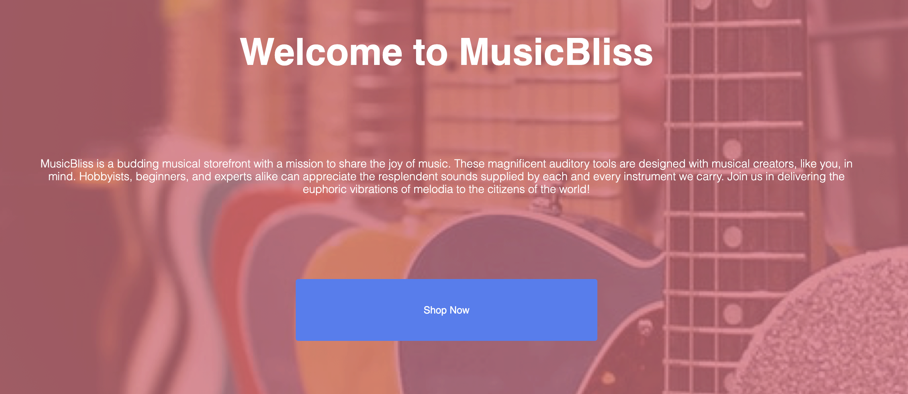
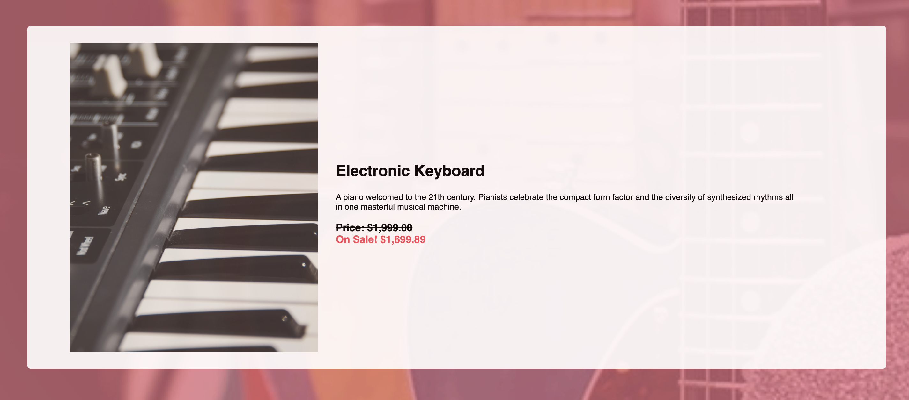
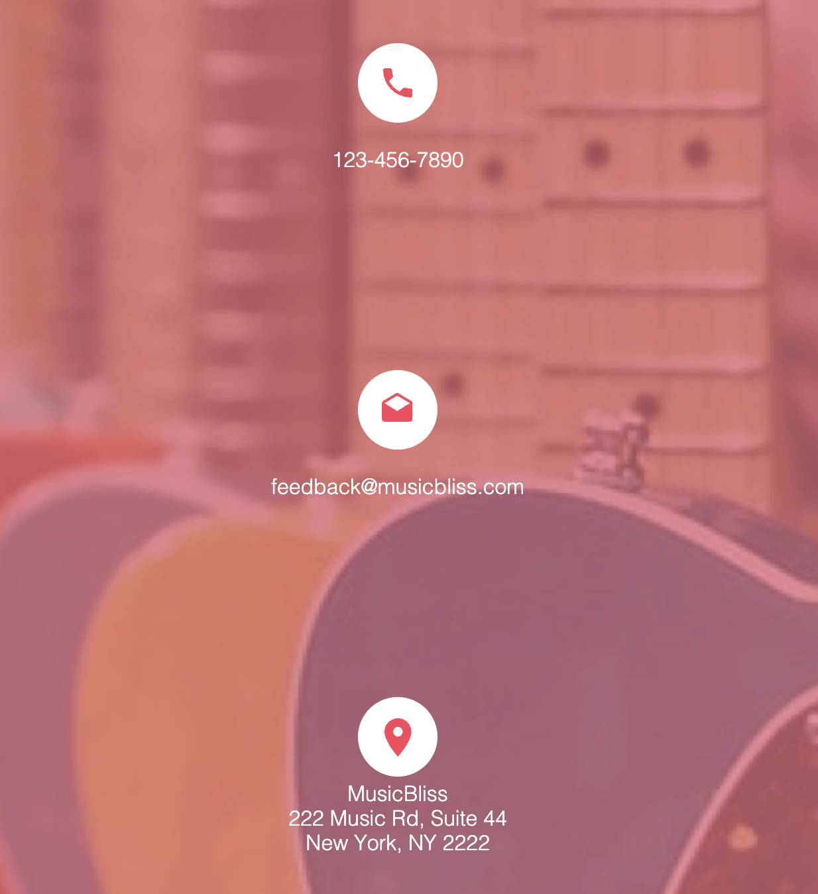

# MusicBliss

MusicBliss is an online musical instruments store that offers a wide variety of instruments, equipment, and accessories for music enthusiasts and professionals alike. With MusicBliss, you can easily find and purchase the musical gear you need to create, perform, and enjoy music at its best.

The MusicBliss website has been updated with a new and stylish design, featuring three separate web pages that provide a seamless and interactive experience for users.

This project helped me learn how to effectively incorporate and interact HTML, CSS, JavaScript and Handlebars to create a multi-page interactive website.

## Acknowledgements

 - [Linkedin Learning - Introduction to Web Design and Development](https://www.linkedin.com/learning/introduction-to-web-design-and-development-14628245/web-design-and-development-in-the-code-and-no-code-era?autoplay=true&u=41910396)
 - [Linkedin Learning - JavaScript Essential Training](https://www.linkedin.com/learning/javascript-essential-training/javascript-the-soil-from-which-the-modern-web-grows?autoplay=true&u=41910396)
 - [Codecademy - Learn Handlebars](https://www.codecademy.com/learn/learn-handlebars)

## Screenshots

Home page: 

Navigation bar: 

One item in the store page: 

Contact page: 

## Author

- [@bisrat415](https://github.com/bisrat415)

## Badge

